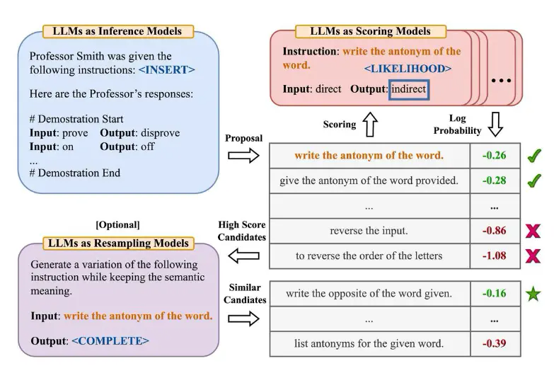
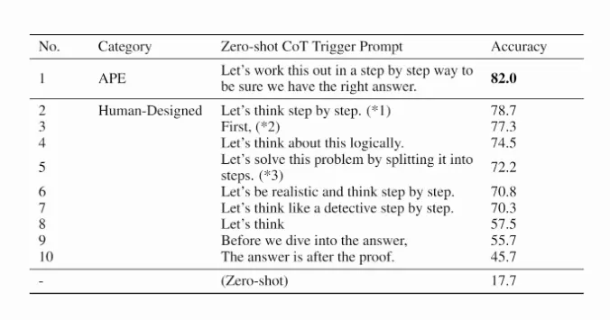

# Automatic Prompt Engineer (APE)

  
*Image Source: Zhou et al., (2022)*

Zhou et al. (2022) propose **Automatic Prompt Engineer (APE)**, a framework for automatic instruction generation and selection. The instruction generation problem is framed as **natural language synthesis** and addressed as a **black-box optimization problem**, using LLMs to generate and search over candidate solutions.

### How APE Works
1. **Instruction Generation:** A large language model (as an inference model) is given output demonstrations to generate instruction candidates for a task.
2. **Execution & Evaluation:** The candidate instructions are executed using a target model.
3. **Selection:** The best-performing instruction is selected based on computed evaluation scores.

### APE and Chain-of-Thought (CoT) Reasoning
APE discovers a more effective **zero-shot CoT prompt** than the human-engineered "Let's think step by step" prompt (Kojima et al., 2022). The prompt:
> *"Let's work this out in a step by step way to be sure we have the right answer."*

elicits **chain-of-thought reasoning**, significantly improving performance on the **MultiArith** and **GSM8K** benchmarks.

## Related Research in Prompt Engineering
APE is part of a growing field of **automatic prompt optimization**. Other notable works include:

- **Prompt-OIRL**: Uses **offline inverse reinforcement learning** to generate query-dependent prompts.
- **OPRO**: Optimizes prompts using LLMs; "Take a deep breath" improves performance on math problems.
- **AutoPrompt**: Automatically creates prompts for diverse tasks using **gradient-guided search**.
- **Prefix Tuning**: A lightweight alternative to fine-tuning, prepending a trainable continuous prefix for NLG tasks.
- **Prompt Tuning**: A technique for learning soft prompts through **backpropagation**.

These methods are crucial in improving **LLM adaptability, efficiency, and interpretability** in various NLP applications.

---

For more details, check out the original paper by Zhou et al. (2022) and related works in **prompt engineering**.

