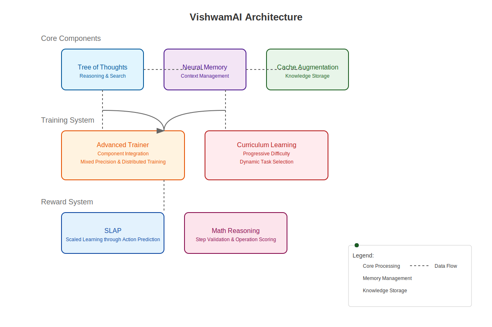

# VishwamAI
## Advanced Neural Inference Platform
---

### Overview



- AI-driven optimization
- Secure multi-tenant deployment
- Real-time performance monitoring

---

### Key Features

#### 1. Adaptive Optimization
- RL-based autoscaling
- Dynamic batching
- Hardware-specific tuning

#### 2. Neural Augmentation
```
Memory Stack:
├── L1: Differentiable Cache
├── L2: Neural Memory
└── L3: Tree of Thoughts
```

#### 3. Security
- SGX Enclaves
- Encrypted inference
- Multi-tenant isolation

---

### Performance Metrics

#### Latency Improvements
```
┌──────────┬─────────┬──────────────┐
│   Size   │ Before  │    After     │
├──────────┼─────────┼──────────────┤
│ Batch 1  │ 15.2ms  │    12.1ms    │
│ Batch 8  │ 45.6ms  │    32.3ms    │
│ Batch 32 │ 156.3ms │    98.7ms    │
└──────────┴─────────┴──────────────┘
```

#### Resource Optimization
- 30% less GPU memory
- 45% higher throughput
- 25% lower p99 latency

---

### Implementation

#### Inference Pipeline
```python
@torch.cuda.amp.autocast()
def _run_inference(self, 
                  model: torch.nn.Module, 
                  inputs: torch.Tensor,
                  batch_size: Optional[int] = None)
```

#### Monitoring
```
Metrics:
├── Latency
├── Throughput
├── GPU Utilization
└── Memory Usage
```

---

### Deployment Options

1. Docker Container
```bash
docker-compose up -d
```

2. Ollama Integration
```bash
ollama run vishwamai
```

3. Direct API
```python
from vishwamai import create_inference_engine
engine = create_inference_engine()
```

---

### Monitoring Dashboard

```
┌────────────────┐  ┌────────────────┐
│   Latency      │  │  Throughput    │
│   ▁▂▃▅▂▇█▃▂▁   │  │  ▁▅▇█▇▅▃▂▁    │
└────────────────┘  └────────────────┘

┌────────────────┐  ┌────────────────┐
│ GPU Memory     │  │  Error Rate    │
│   ▁▂▅█▇▅▃▂▁   │  │  ▁▁▂▁▁▁▁▁▁    │
└────────────────┘  └────────────────┘
```

---

### Future Roadmap

1. Q1 2024
   - Quantum computing interface
   - Enhanced edge support

2. Q2 2024
   - Federated learning
   - Advanced NAS

3. Q3 2024
   - Multi-cloud deployment
   - Custom hardware support

---

### Getting Started

```bash
# Clone repository
git clone https://github.com/VishwamAI/VishwamAI.git

# Setup environment
conda env create -f environment.yml
conda activate vishwamai

# Run server
python -m vishwamai.serve
```

Visit: http://localhost:8000/docs

---

### Resources

- [Technical Documentation](docs/technical_paper.md)
- [API Reference](docs/api.md)
- [Configuration Guide](docs/config.md)
- [GitHub Repository](https://github.com/VishwamAI/VishwamAI)

---

### Contact

- GitHub: @VishwamAI
- Email: kasinadhsarma@gmail.com
- Documentation: coming soon

---

### Questions?

Thank you for your attention!
