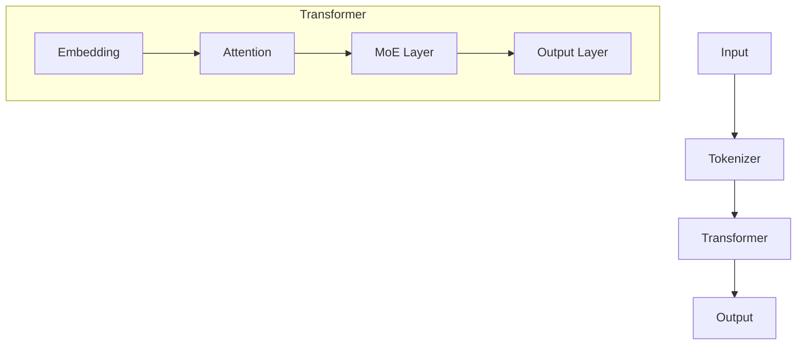

# VishwamAI Technical Documentation

## Overview
VishwamAI is a TPU-optimized text-to-text generation model implementing a transformer architecture with advanced features such as Flash Attention, Mixture of Experts (MoE), and knowledge distillation capabilities.

## Documentation Structure

1. [Architecture Overview](01_architecture_overview.md)
   - Model Architecture
   - TPU Optimizations
   - Component Interactions
   - Advanced Features

2. [Core Components](02_core_components.md)
   - Model Implementation
   - Flash Attention
   - Layer Architecture
   - Tokenizer Details
   - Training Pipeline

3. [Configuration Guide](03_configuration_guide.md)
   - Model Configuration
   - Training Configuration
   - TPU Configuration
   - Optimization Settings
   - Logging Configuration

4. [Advanced Features](04_advanced_features.md)
   - Knowledge Distillation
   - Tree of Thoughts (ToT)
   - Chain of Thought (CoT)
   - Integration Features
   - Performance Optimization

5. [Performance Optimizations](05_performance_optimizations.md)
   - TPU Optimizations
   - Mixed Precision Training
   - Memory Management
   - Parallel Processing
   - Profiling and Monitoring

6. [Usage Guide](06_usage_guide.md)
   - Quick Start
   - Training Examples
   - Advanced Usage
   - Common Use Cases
   - Best Practices

## Quick Links

### Key Features
- TPU-optimized transformer architecture
- Flash Attention implementation
- Mixture of Experts support
- Knowledge distillation capabilities
- Tree of Thoughts reasoning
- Chain of Thought processing

### Performance Features
- Mixed precision support (FP8/BF16)
- Memory-efficient attention
- Gradient checkpointing
- Dynamic batch sizing
- TPU-specific optimizations

### Training Features
- Distributed training support
- Knowledge distillation
- Mixed precision training
- Gradient accumulation
- Performance monitoring

## Model Architecture



## Usage Example

```python
from vishwamai import VishwamAI, VishwamAITokenizer

# Load model
model = VishwamAI.from_pretrained("vishwamai/base")
tokenizer = VishwamAITokenizer.from_pretrained("vishwamai/base")

# Generate text
text = "Explain the concept of machine learning:"
input_ids = tokenizer.encode(text, return_tensors="jax")
outputs = model.generate(input_ids, max_length=512)
response = tokenizer.decode(outputs[0], skip_special_tokens=True)
```

## Contributing
For information about contributing to VishwamAI, please refer to our [Contributing Guide](../../CONTRIBUTING.md).

## License
VishwamAI is released under the [Apache 2.0 License](../../LICENSE).

## Support
For technical support or questions:
- Open an issue on GitHub
- Refer to the documentation
- Contact the development team
