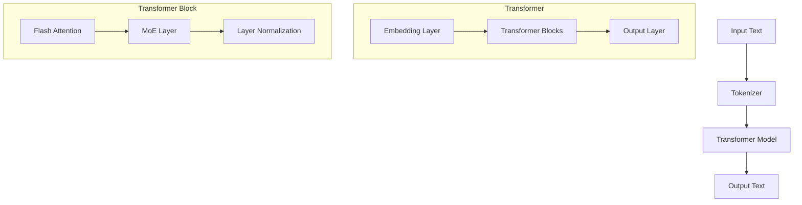
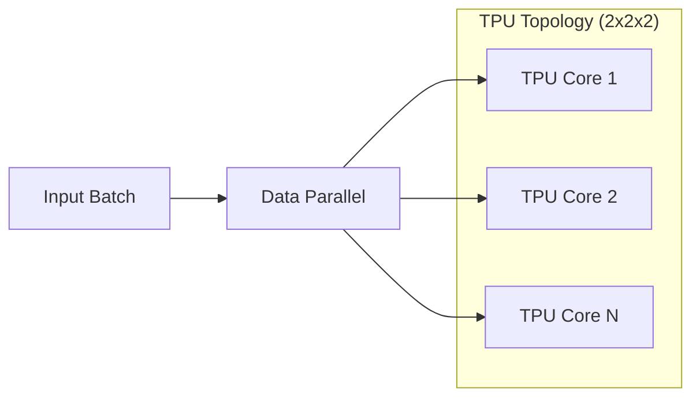
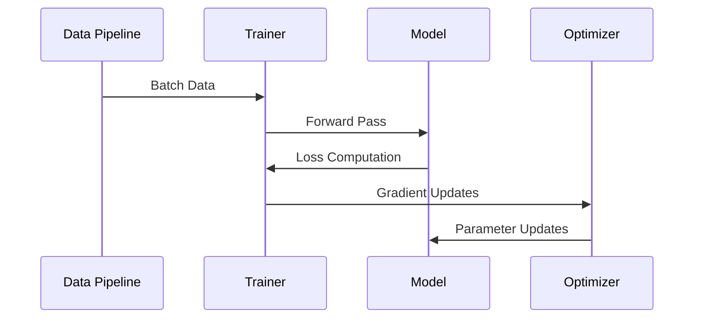
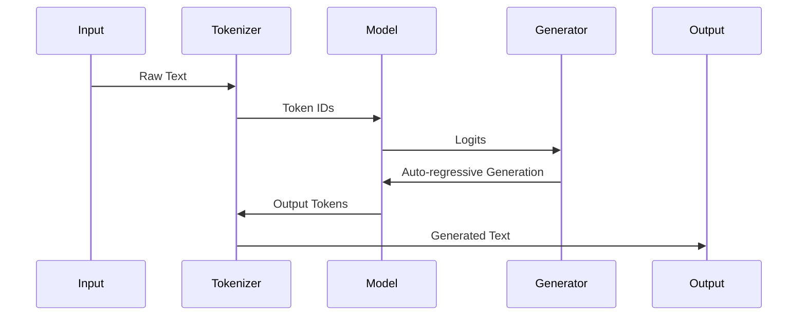

# VishwamAI Architecture Overview

## Introduction

VishwamAI is a TPU-optimized text-to-text generation model implementing a transformer architecture with advanced features such as Flash Attention, Mixture of Experts (MoE), and knowledge distillation capabilities.

## Model Architecture

### Core Components

### Key Specifications

- Model Size: Configurable (Default: 768 hidden dimensions)
- Layers: 24 transformer blocks
- Attention Heads: 12 (with 4 KV heads)
- Vocabulary Size: 131,072 tokens
- Maximum Sequence Length: 2,048 tokens
- Mixed Precision: BF16/FP8 support

## TPU Optimizations

### Memory and Compute Optimizations

1. Flash Attention
   - Block-sparse attention computation
   - Optimized memory access patterns
   - TPU-specific block sizes (128)

2. Mixed Precision
   - BFloat16 for stability
   - FP8 for memory efficiency
   - Dynamic scaling support

3. Memory Management
   - Gradient checkpointing
   - KV cache optimization
   - Memory-efficient attention

### Parallelism Strategy

- Data Parallel Training
- 8 TPU Core Configuration
- Gradient Accumulation Support
- Model State Sharding

## Component Interactions

### Training Pipeline

### Inference Pipeline

## Advanced Features

1. Knowledge Distillation
   - Teacher model: Gemma-7B
   - Temperature scaling
   - Intermediate layer distillation

2. Tree of Thoughts (ToT)
   - Max branches: 3
   - Max depth: 3
   - Beam width: 5
   - Temperature: 0.7

3. Chain of Thought (CoT)
   - Prompt engineering support
   - Reasoning step tracking
   - Output verification

## Performance Characteristics

- Training throughput optimized for TPU v2/v3
- Memory-efficient attention mechanisms
- Gradient accumulation for effective batch sizing
- Dynamic scaling for numerical stability
