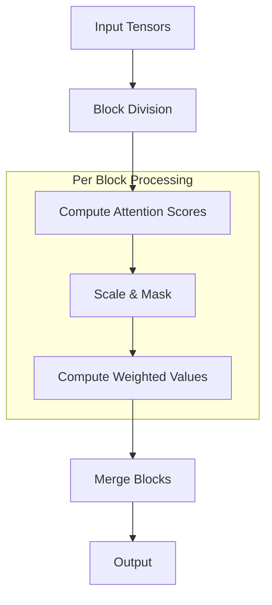
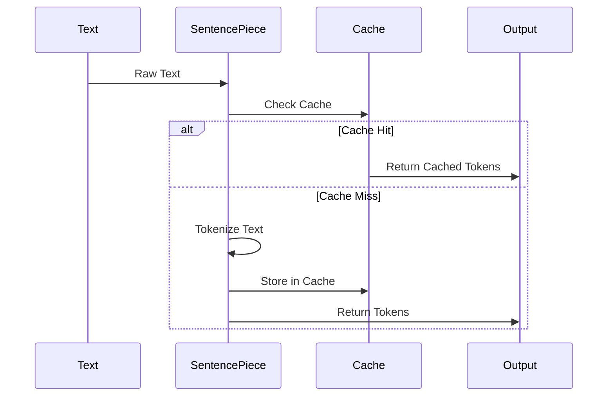
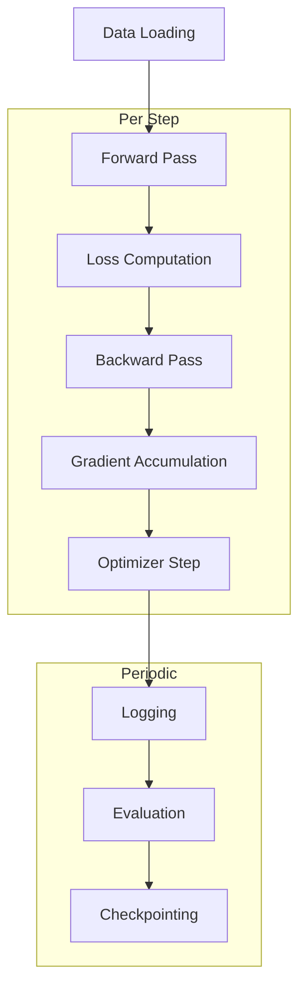

# VishwamAI Core Components

## Model Implementation

### VishwamAI Model Class

The core model class implements a transformer architecture with the following key features:

```python
class VishwamAI(nn.Module):
    vocab_size: int
    hidden_size: int = 4096
    num_layers: int = 32
    num_heads: int = 32
    num_experts: int = 8
    ffn_dim: int = 16384
```

Key characteristics:
- Configurable model dimensions
- Mixture of Experts (MoE) support
- TPU-optimized layer implementations
- Knowledge distillation capabilities

## Flash Attention Implementation

### Overview

The Flash Attention mechanism is implemented with TPU-specific optimizations:

```python
def flash_attention(
    q: jnp.ndarray,  # [batch, q_len, num_heads, head_dim]
    k: jnp.ndarray,  # [batch, kv_len, num_heads, head_dim]
    v: jnp.ndarray,  # [batch, kv_len, num_heads, head_dim]
    mask: Optional[jnp.ndarray] = None,
    block_size: int = 128
)
```

Features:
- Block-sparse computation pattern
- Memory-efficient implementation
- TPU-optimized block sizes
- Causal masking support
- Optional dropout during training

### Block Processing



## Layer Architecture

### TPU-Optimized Layers

1. TPUGEMMLinear
```python
class TPUGEMMLinear(nn.Module):
    """Linear layer with TPU-optimized GEMM operations"""
    features: int
    use_bias: bool = True
    use_fp8: bool = True
    block_size: int = 128
```

2. TPULayerNorm
```python
class TPULayerNorm(nn.Module):
    """TPU-optimized Layer Normalization"""
    epsilon: float = 1e-6
    use_bias: bool = True
    use_scale: bool = True
```

3. TPUMultiHeadAttention
```python
class TPUMultiHeadAttention(nn.Module):
    """TPU-optimized Multi-Head Attention with Flash Attention"""
    num_heads: int
    head_dim: int
    use_flash_attn: bool = True
    use_fp8: bool = True
```

### Memory Optimizations

- Gradient checkpointing
- KV cache for inference
- Mixed precision support
- Dynamic tensor sharding

## Tokenizer Details

### SentencePiece Implementation

```python
class VishwamAITokenizer:
    def __init__(
        self,
        model_path: str,
        max_length: int = 512,
        pad_token: str = "[PAD]",
        unk_token: str = "[UNK]",
        bos_token: str = "[BOS]",
        eos_token: str = "[EOS]"
    )
```

Features:
- Vocabulary size: 131,072 tokens
- Special token handling
- Caching for frequent tokens
- Batch processing support
- HuggingFace compatibility

### Tokenization Process



## Training Pipeline

### Trainer Implementation

```python
class VishwamAITrainer:
    def __init__(
        self,
        pipeline: VishwamAIPipeline,
        config: Dict[str, Any],
        train_loader: Iterator,
        eval_loader: Optional[Iterator] = None
    )
```

Key features:
- TPU-optimized training loop
- Gradient accumulation
- Mixed precision training
- Knowledge distillation support
- Automatic checkpointing
- DuckDB logging integration

### Training Process



### Performance Optimizations

1. Data Pipeline
   - Prefetching
   - Batch accumulation
   - Memory pinning

2. Computation
   - Mixed precision (BF16/FP8)
   - Flash Attention
   - Gradient checkpointing

3. Memory
   - KV cache optimization
   - Gradient accumulation
   - State sharding

4. Monitoring
   - DuckDB logging
   - Profiling support
   - Memory tracking

## Integration Points

### Model-Tokenizer Integration
- Shared vocabulary
- Special token handling
- Batch processing alignment

### Training-Inference Pipeline
- KV cache sharing
- State management
- Memory optimization

### TPU-Specific Integration
- XLA compilation
- Memory layout optimization
- Device mesh management
