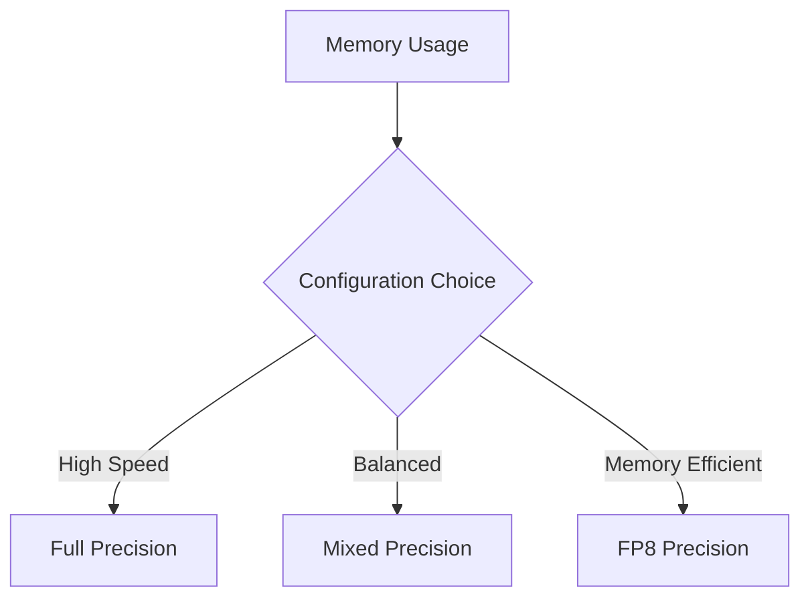

# VishwamAI Configuration Guide

This document provides a comprehensive guide to configuring the VishwamAI model and its training pipeline.

## Model Configuration

### Base Model Parameters

```json
{
    "model": {
        "vocab_size": 131072,
        "hidden_dim": 768,
        "num_layers": 24,
        "num_heads": 12,
        "head_dim": 64,
        "mlp_dim": 3072,
        "max_seq_len": 2048,
        "dropout_rate": 0.1
    }
}
```

#### Parameter Descriptions

- `vocab_size`: Size of the token vocabulary
- `hidden_dim`: Dimension of hidden layers
- `num_layers`: Number of transformer blocks
- `num_heads`: Number of attention heads
- `head_dim`: Dimension per attention head
- `mlp_dim`: Dimension of feed-forward layers
- `max_seq_len`: Maximum sequence length
- `dropout_rate`: Dropout probability

## Training Configuration

### Basic Training Parameters

```json
{
    "training": {
        "batch_size": 8,
        "grad_accum_steps": 4,
        "learning_rate": 1e-4,
        "warmup_steps": 2000,
        "max_steps": 500000,
        "weight_decay": 0.01,
        "max_grad_norm": 1.0
    }
}
```

#### Parameter Descriptions

- `batch_size`: Per-device batch size
- `grad_accum_steps`: Number of gradient accumulation steps
- `learning_rate`: Peak learning rate
- `warmup_steps`: Learning rate warmup steps
- `max_steps`: Total training steps
- `weight_decay`: AdamW weight decay
- `max_grad_norm`: Gradient clipping norm

### Training Schedule


## TPU Configuration

### Hardware Settings

```json
{
    "tpu": {
        "tpu_cores": 8,
        "tpu_topology": "2x2x2",
        "device_strategy": "data_parallel",
        "use_bfloat16": true,
        "mesh_shape": {
            "data": 8,
            "model": 1
        }
    }
}
```

#### Parameter Descriptions

- `tpu_cores`: Number of TPU cores
- `tpu_topology`: TPU pod slice topology
- `device_strategy`: Parallelization strategy
- `mesh_shape`: Device mesh configuration

### Memory Management

```json
{
    "memory": {
        "gradient_checkpointing": true,
        "attention_memory_efficient": true,
        "kv_cache_fp8": true,
        "use_memory_efficient_attention": true
    }
}
```

## Optimization Configuration

### Precision and Performance

```json
{
    "optimization": {
        "use_fp8": true,
        "use_pjit": true,
        "block_size": 128,
        "use_dynamic_scale": true,
        "mixed_precision": true,
        "shard_weights": true
    }
}
```

#### Feature Descriptions

- `use_fp8`: Enable FP8 precision
- `use_pjit`: Enable parallel execution
- `block_size`: Computation block size
- `use_dynamic_scale`: Enable dynamic scaling
- `mixed_precision`: Enable mixed precision
- `shard_weights`: Enable weight sharding

### Memory vs Speed Tradeoffs



## Distillation Configuration

### Knowledge Distillation

```json
{
    "distillation": {
        "teacher_model": "gemma-7b",
        "temperature": 2.0,
        "alpha": 0.5,
        "use_intermediate_distillation": true,
        "intermediate_layer_mapping": "uniform"
    }
}
```

#### Parameter Descriptions

- `teacher_model`: Teacher model identifier
- `temperature`: Softmax temperature
- `alpha`: Distillation loss weight
- `use_intermediate_distillation`: Enable intermediate layer distillation
- `intermediate_layer_mapping`: Layer mapping strategy

## Sequence Generation

### Generation Parameters

```json
{
    "sequence": {
        "max_length": 2048,
        "min_length": 8,
        "pad_token_id": 0,
        "eos_token_id": 1,
        "chunk_size": 128
    }
}
```

## Logging Configuration

### Logging and Checkpointing

```json
{
    "logging": {
        "log_every": 100,
        "eval_every": 1000,
        "save_every": 10000,
        "profile_every": 5000
    }
}
```

## Example Configurations

### Training on TPU v3-8

```json
{
    "model": {
        "hidden_dim": 768,
        "num_layers": 24
    },
    "training": {
        "batch_size": 8,
        "grad_accum_steps": 4
    },
    "optimization": {
        "use_fp8": true,
        "block_size": 128
    },
    "tpu": {
        "tpu_cores": 8,
        "device_strategy": "data_parallel"
    }
}
```

### Memory-Efficient Configuration

```json
{
    "model": {
        "hidden_dim": 768,
        "num_layers": 24
    },
    "memory": {
        "gradient_checkpointing": true,
        "kv_cache_fp8": true
    },
    "optimization": {
        "use_fp8": true,
        "mixed_precision": true
    }
}
```

## Best Practices

1. Memory Management
   - Enable gradient checkpointing for large models
   - Use FP8 precision for memory efficiency
   - Enable KV cache optimization for inference

2. Training Stability
   - Start with small learning rates
   - Use gradient clipping
   - Enable mixed precision training
   - Implement proper warmup schedule

3. TPU Optimization
   - Use TPU-optimized block sizes
   - Enable data parallelism for small models
   - Consider model parallelism for large models
   - Optimize device mesh configuration

4. Performance Monitoring
   - Regular profiling
   - Memory usage tracking
   - Training metrics logging
   - Regular checkpointing
