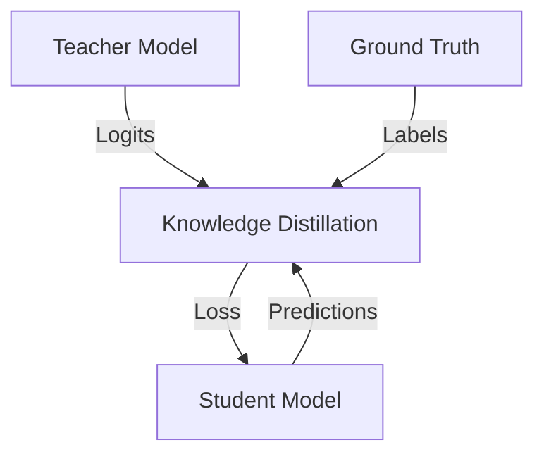
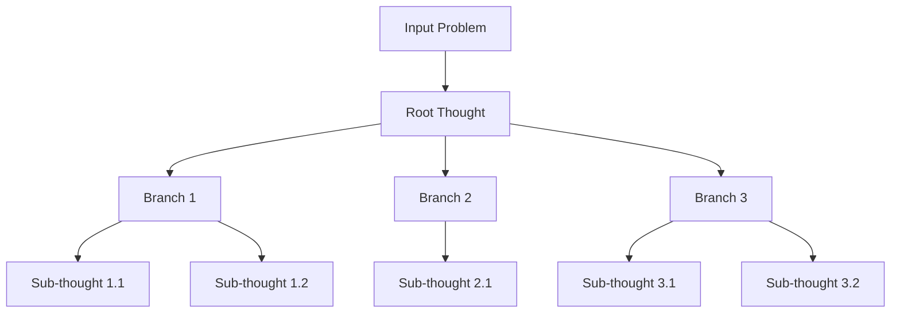
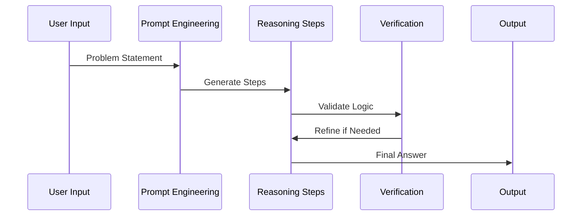

# VishwamAI Advanced Features

This document details the advanced features implemented in VishwamAI, including knowledge distillation, Tree of Thoughts (ToT), and Chain of Thought (CoT) capabilities.

## Knowledge Distillation

### Overview

Knowledge distillation in VishwamAI enables training smaller, more efficient models while maintaining performance by learning from a larger teacher model (Gemma-7B).



### Implementation Details

```python
class DistillationTrainer:
    def compute_distillation_loss(
        self,
        student_logits: jnp.ndarray,
        teacher_logits: jnp.ndarray,
        labels: jnp.ndarray,
        attention_mask: Optional[jnp.ndarray] = None,
    ) -> jnp.ndarray:
        """
        Compute the distillation loss combining:
        - Hard loss (cross-entropy with true labels)
        - Soft loss (KL divergence with teacher predictions)
        """
```

### Key Features

1. Temperature Scaling
   - Dynamic temperature adjustment
   - Smoothing of probability distributions
   - Controlled information transfer

2. Intermediate Layer Distillation
   - Layer-wise knowledge transfer
   - Feature alignment
   - Progressive distillation

3. Loss Balancing
   - Adaptive loss weighting
   - Curriculum learning
   - Confidence-based weighting

## Tree of Thoughts (ToT)

### Architecture



### Implementation

```python
class TreeOfThoughts:
    """
    Implements tree-based reasoning for complex problem solving.
    """
    def __init__(
        self,
        model: VishwamAI,
        max_branches: int = 3,
        max_depth: int = 3,
        beam_width: int = 5,
        temperature: float = 0.7
    ):
```

### Key Components

1. Thought Generation
```python
def generate_thoughts(
    self,
    context: str,
    num_thoughts: int = 3,
    temperature: float = 0.7
) -> List[str]:
    """Generate multiple potential thought branches"""
```

2. Value Estimation
```python
def estimate_value(
    self,
    thought_sequence: List[str],
    objective: str
) -> float:
    """Estimate the value of a thought sequence"""
```

3. Tree Search
```python
def search(
    self,
    initial_prompt: str,
    objective: str,
    max_steps: int = 10
) -> List[str]:
    """Perform tree search to find solution path"""
```

## Chain of Thought (CoT)

### Process Flow



### Implementation

```python
class ChainOfThought:
    def __init__(
        self,
        model: VishwamAI,
        max_steps: int = 5,
        temperature: float = 0.7
    ):
```

### Key Features

1. Step Generation
```python
def generate_reasoning_steps(
    self,
    problem: str,
    context: Optional[str] = None
) -> List[str]:
    """Generate step-by-step reasoning"""
```

2. Validation
```python
def validate_step(
    self,
    step: str,
    previous_steps: List[str],
    context: str
) -> bool:
    """Validate logical consistency of steps"""
```

3. Refinement
```python
def refine_reasoning(
    self,
    steps: List[str],
    feedback: str
) -> List[str]:
    """Refine reasoning based on feedback"""
```

## Integration Features

### ToT-CoT Integration

```python
class IntegratedReasoning:
    """
    Combines Tree of Thoughts and Chain of Thought for
    enhanced problem-solving capabilities.
    """
```

Key aspects:
1. Dynamic switching between approaches
2. Hybrid reasoning strategies
3. Adaptive depth control

### Memory Management

```python
class ThoughtMemory:
    """
    Manages thought history and context for reasoning.
    """
```

Features:
1. Context retention
2. Priority-based memory
3. Efficient retrieval

## Performance Optimization

### Caching Strategy

1. KV Cache
```json
{
    "cache_config": {
        "max_cache_size": "8GB",
        "cache_type": "fp8",
        "pruning_strategy": "lru"
    }
}
```

2. Thought Cache
```python
@lru_cache(maxsize=1000)
def cached_thought_generation(
    self,
    context_hash: str,
    temperature: float
) -> List[str]:
```

### Parallel Processing

1. Batch Processing
   - Parallel thought generation
   - Concurrent path evaluation
   - Distributed search

2. TPU Optimization
   - Batched inference
   - Memory-efficient storage
   - Optimized graph execution

## Usage Examples

### Tree of Thoughts Example

```python
tot = TreeOfThoughts(model)
solution = tot.solve_problem(
    problem="Decompose the task of writing a research paper",
    objective="Complete, logical breakdown",
    max_steps=5
)
```

### Chain of Thought Example

```python
cot = ChainOfThought(model)
solution = cot.solve_problem(
    problem="Solve a complex math problem",
    show_work=True,
    validate_steps=True
)
```

### Integrated Reasoning Example

```python
reasoner = IntegratedReasoning(model)
solution = reasoner.solve(
    problem="Design a system architecture",
    approach="hybrid",
    max_depth=4
)
