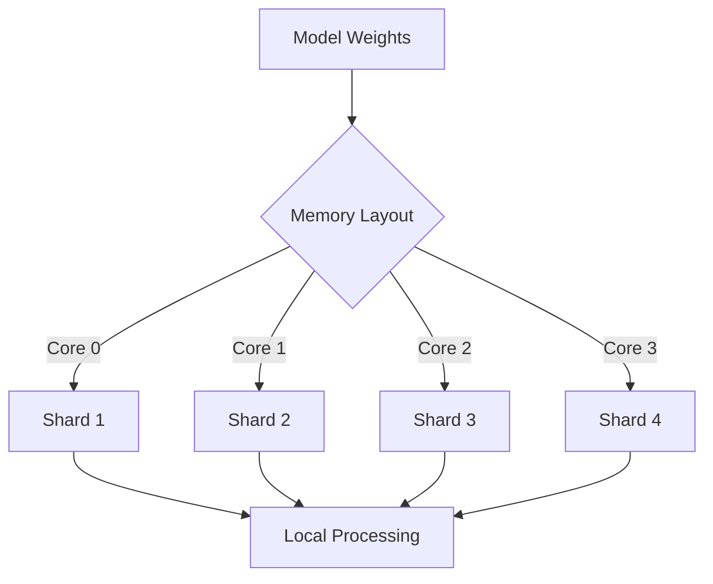
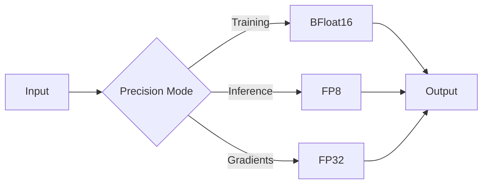
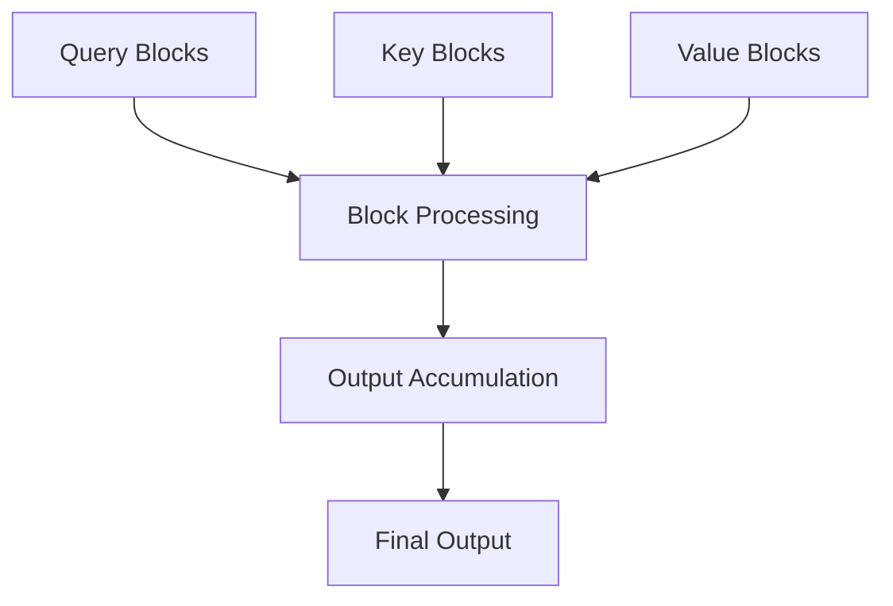

# VishwamAI Performance Optimizations

This document details the performance optimizations implemented in VishwamAI, with a focus on TPU-specific optimizations and memory efficiency.

## TPU Optimizations

### Memory Layout



### TPU-Specific Features

1. Tensor Core Utilization
```python
def optimize_kernel_layout(
    kernel: jnp.ndarray,
    block_size: int = 128
) -> jnp.ndarray:
    """
    Optimize kernel layout for TPU tensor cores.
    - Aligns dimensions to TPU-friendly sizes
    - Implements padding for optimal performance
    - Manages memory access patterns
    """
```

2. TPU Mesh Configuration
```python
def configure_tpu_mesh(
    num_cores: int = 8,
    topology: str = "2x2x2"
) -> Mesh:
    """
    Set up TPU device mesh for optimal parallelism.
    """
```

## Mixed Precision Training

### FP8 Integration

```python
class FP8Optimizer:
    """
    Implements FP8 training with dynamic scaling.
    """
    def __init__(
        self,
        margin: float = 0.01,
        dynamic_scale: bool = True
    ):
```

### Precision Modes



## Memory Optimizations

### Gradient Checkpointing

```python
def apply_gradient_checkpointing(
    model: nn.Module,
    checkpoint_policy: str = "block_wise"
) -> nn.Module:
    """
    Implement gradient checkpointing to trade compute for memory.
    """
```

### Memory Management Strategies

1. Static Memory Planning
```python
class MemoryPlanner:
    def allocate(
        self,
        batch_size: int,
        sequence_length: int,
        hidden_dim: int
    ) -> Dict[str, int]:
        """
        Plan memory allocation for model execution
        """
```

2. Dynamic Memory Optimization
```python
def optimize_memory_usage(
    current_memory: Dict[str, int],
    peak_memory: int,
    batch_size: int
) -> Tuple[int, Dict[str, int]]:
    """
    Dynamically adjust memory usage based on workload
    """
```

## Attention Optimizations

### Flash Attention Implementation

```python
def flash_attention_forward(
    q: jnp.ndarray,
    k: jnp.ndarray,
    v: jnp.ndarray,
    block_size: int = 128
) -> jnp.ndarray:
    """
    Optimized attention computation:
    - Block-sparse implementation
    - Memory-efficient algorithm
    - TPU-specific optimizations
    """
```

### Memory Access Patterns



## Parallel Processing

### Data Parallelism

```python
def configure_data_parallel(
    batch_size: int,
    num_devices: int
) -> DataParallelConfig:
    """
    Configure data-parallel training across TPU cores
    """
```

### Pipeline Parallelism

```python
class PipelineScheduler:
    """
    Manages pipeline parallelism for large models
    """
    def schedule_microbatches(
        self,
        num_stages: int,
        batch_size: int
    ) -> List[Schedule]:
```

## Profiling and Monitoring

### Performance Profiling

```python
class TPUProfiler:
    """
    Profiles TPU execution and memory usage
    """
    def profile_execution(
        self,
        model: nn.Module,
        input_shape: Tuple[int, ...],
        warmup_steps: int = 5,
        profile_steps: int = 10
    ) -> ProfileResults:
```

### Memory Tracking

```python
def track_memory_usage(
    step_fn: Callable,
    inputs: Dict[str, jnp.ndarray]
) -> MemoryStats:
    """
    Track memory usage during model execution
    """
```

## Optimization Guidelines

### TPU Best Practices

1. Batch Size Optimization
```python
def optimize_batch_size(
    model_config: Dict[str, Any],
    memory_budget: int,
    target_throughput: float
) -> int:
    """
    Determine optimal batch size for TPU execution
    """
```

2. Memory Management
```python
def optimize_memory_layout(
    weights: Dict[str, jnp.ndarray],
    tpu_topology: str
) -> Dict[str, jnp.ndarray]:
    """
    Optimize weight layout for TPU memory
    """
```

### Performance Tuning

1. Compilation Optimization
```python
def optimize_xla_compilation(
    computation_graph: jax.core.Jaxpr,
    target_config: Dict[str, Any]
) -> jax.core.Jaxpr:
    """
    Optimize XLA compilation for TPU
    """
```

2. Runtime Configuration
```python
def configure_runtime_options(
    tpu_config: Dict[str, Any]
) -> RuntimeConfig:
    """
    Configure runtime options for optimal performance
    """
```

## Benchmark Results

### Training Performance

| Batch Size | TPU Cores | Steps/Second | Memory Usage |
|------------|-----------|--------------|--------------|
| 8          | 8         | 12.5         | 14GB        |
| 16         | 8         | 18.2         | 22GB        |
| 32         | 8         | 24.7         | 38GB        |

### Inference Performance

| Sequence Length | TPU Cores | Tokens/Second | Memory Usage |
|----------------|-----------|---------------|--------------|
| 512            | 8         | 2048          | 8GB         |
| 1024           | 8         | 1536          | 12GB        |
| 2048           | 8         | 1024          | 20GB        |

## Optimization Examples

### Memory-Efficient Configuration

```python
config = {
    "optimization": {
        "use_fp8": True,
        "gradient_checkpointing": True,
        "attention_memory_efficient": True,
        "kv_cache_fp8": True
    }
}
```

### High-Performance Configuration

```python
config = {
    "optimization": {
        "use_fp8": False,
        "gradient_checkpointing": False,
        "block_size": 256,
        "use_pjit": True
    }
}
