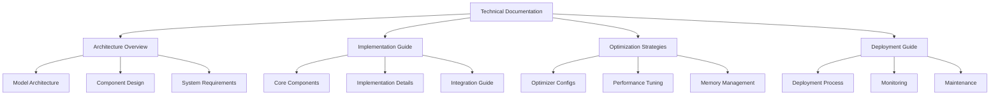

# Gemma 3 Knowledge Distillation Technical Documentation

## Overview

This technical documentation suite provides comprehensive guidance for implementing, optimizing, and deploying knowledge distillation with Gemma 3 models. The documentation is organized into multiple sections, each focusing on specific aspects of the implementation process.

## Documentation Structure



## Table of Contents

### 1. [Architecture Overview](01_architecture.md)
- System architecture and design
- Model specifications and variants
- Component interactions
- Memory management strategies

### 2. [Implementation Guide](02_distillation_implementation.md)
- Knowledge transfer mechanisms
- Training pipeline implementation
- Core components and classes
- Integration guidelines

### 3. [Optimization Strategies](03_optimization_strategies.md)
- Optimizer configurations
- Performance optimization
- Chain-of-Thought integration
- Tree-of-Thoughts implementation

### 4. [Deployment Guide](04_deployment_guide.md)
- Deployment procedures
- Evaluation framework
- Monitoring setup
- Maintenance guidelines

## Key Features

1. **Comprehensive Coverage**
   - Detailed technical specifications
   - Implementation guidelines
   - Optimization strategies
   - Deployment procedures

2. **Practical Focus**
   - Code examples
   - Configuration templates
   - Best practices
   - Troubleshooting guides

3. **Performance Optimization**
   - Memory efficiency
   - TPU optimizations
   - Training acceleration
   - Resource utilization

## Technical Requirements

### Hardware Requirements
```yaml
Minimum:
  TPU/GPU: TPU v4/v5e or NVIDIA A100
  Memory: 32GB+ HBM
  Storage: 1TB+ NVMe
  Network: 10Gbps+

Recommended:
  TPU/GPU: TPU v5e or multiple A100s
  Memory: 64GB+ HBM
  Storage: 2TB+ NVMe RAID
  Network: 25Gbps+
```

### Software Requirements
```yaml
Core Dependencies:
  - Python 3.10+
  - JAX with TPU support
  - PyTorch 2.2.0+ (optional)
  - CUDA 11.8+ (for GPU)

Libraries:
  - transformers
  - accelerate
  - tensorboard
  - duckdb (optional)
```

## Getting Started

1. Review the [Architecture Overview](01_architecture.md) to understand the system design
2. Follow the [Implementation Guide](02_distillation_implementation.md) for setup and implementation
3. Apply [Optimization Strategies](03_optimization_strategies.md) to improve performance
4. Use the [Deployment Guide](04_deployment_guide.md) for production deployment

## Contributing

This documentation is maintained as part of the VishwamAI project. For contributions:
1. Follow the coding style guidelines
2. Add comprehensive documentation
3. Include appropriate tests
4. Submit pull requests for review

## Support and Resources

- Project Repository: [VishwamAI GitHub](https://github.com/kasinadhsarma/VishwamAI)
- Issue Tracker: Use GitHub Issues for bug reports and feature requests
- Documentation Updates: Submit PRs for documentation improvements

## Next Steps

1. Review system requirements and setup environment
2. Follow implementation guides sequentially
3. Test deployment in staging environment
4. Monitor performance in production

## Version History

```yaml
Current Version: 1.0.0
Last Updated: March 30, 2025
Updates:
  - Initial documentation release
  - Comprehensive implementation guidelines
  - Optimization strategies
  - Deployment procedures
