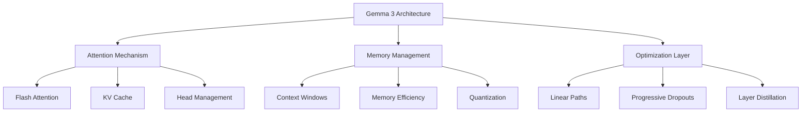
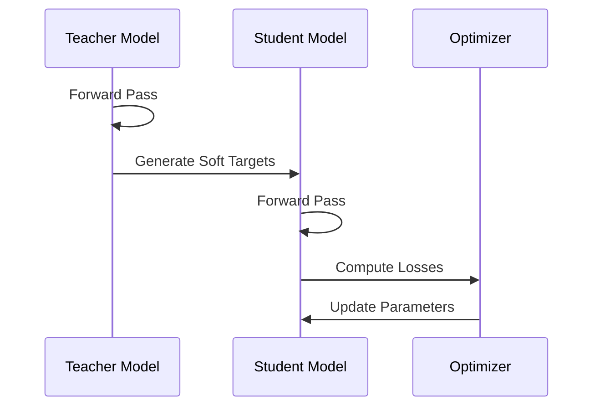

# Gemma 3 Knowledge Distillation Architecture

## Overview

This document outlines the architecture and technical approach for implementing knowledge distillation with Gemma 3 models, focusing on efficient training and deployment on single GPU/TPU systems.

## Model Architecture

### Model Variants and Specifications

| Feature        | 1B          | 4B          | 12B         | 27B         |
|---------------|-------------|-------------|-------------|-------------|
| Parameters    | 1 Billion   | 4 Billion   | 12 Billion  | 27 Billion  |
| Context Length| 32K         | 128K        | 128K        | 128K        |
| Multimodality | Yes         | Yes         | Yes         | Yes         |
| Quantization  | int4        | int4, fp8   | int4, fp8   | int4, fp8   |
| Hardware      | CPU/GPU     | Single GPU  | Single GPU  | Single GPU  |

### Architectural Components



## Knowledge Distillation Framework

### Teacher-Student Architecture

The knowledge distillation framework utilizes a larger Gemma 3 model (e.g., 27B parameters) as the teacher and transfers knowledge to a smaller model (e.g., 4B parameters) through multiple mechanisms:

1. **Linear Path Embeddings**
   - Efficient knowledge transfer through optimized linear projections
   - TPU-optimized layer normalization
   - Dropout regularization during training

2. **Intermediate Layer Distillation**
   - Feature-level knowledge transfer
   - Cosine similarity loss for representation alignment
   - Progressive layer mapping strategies

3. **Attention Map Transfer**
   - Direct transfer of attention patterns
   - Temperature-scaled softmax distributions
   - Masked attention handling

## Memory Optimization

### Zero-3 Style Optimizations

1. **Parameter Sharding**
   - Optimizer state partitioning
   - Gradient accumulation
   - Dynamic memory management

2. **Quantization Strategy**
   ```python
   class QuantizationConfig:
       int4_weights: bool = True
       fp8_activation: bool = True
       block_size: int = 128
       optimize_memory: bool = True
   ```

### TPU-Specific Optimizations

1. **Memory Layout**
   - Optimal tensor shapes for TPU
   - Efficient data loading patterns
   - Hardware-aware batch processing

2. **Computation Patterns**
   - JIT compilation strategies
   - XLA optimization techniques
   - Custom TPU kernels

## Training Pipeline

### Distillation Process



### Training Configuration

```python
class DistillationConfig:
    teacher_model: str = "gemma-3-27b"
    student_model: str = "gemma-3-4b"
    temperature: float = 2.0
    alpha: float = 0.5
    batch_size: int = 32
    gradient_accumulation_steps: int = 4
    use_flash_attention: bool = True
    use_quantization: bool = True
```

## Performance Monitoring

### Key Metrics

1. **Training Metrics**
   - Loss convergence
   - Knowledge transfer efficiency
   - Memory utilization
   - Training throughput

2. **Evaluation Metrics**
   - Model perplexity
   - Teacher-student agreement
   - Inference latency
   - Memory footprint

## Implementation Considerations

### Hardware Requirements

1. **Minimum Requirements**
   - TPU v4/v5e or equivalent GPU
   - 32GB+ RAM
   - NVMe storage for efficient data loading

2. **Recommended Setup**
   - TPU v5e or A100 GPU
   - 64GB+ RAM
   - High-bandwidth storage system

### Optimization Guidelines

1. **Memory Management**
   - Implement gradient checkpointing
   - Use efficient attention mechanisms
   - Optimize batch sizes for hardware

2. **Training Efficiency**
   - Leverage mixed precision training
   - Implement efficient data loading
   - Optimize model parallelism

## Next Steps

1. Implementation of core distillation components
2. Integration of TPU-specific optimizations
3. Development of training pipeline
4. Creation of evaluation framework
