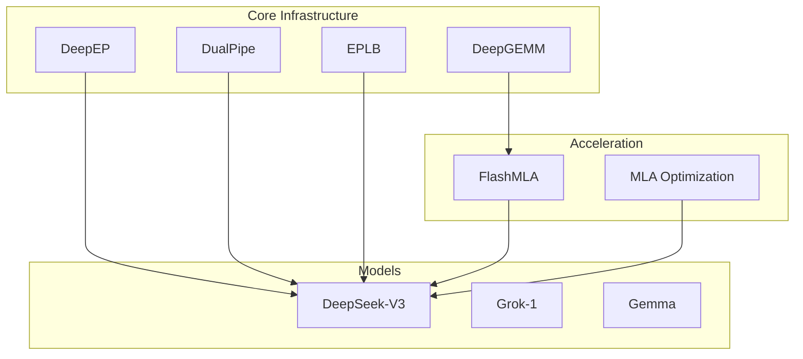
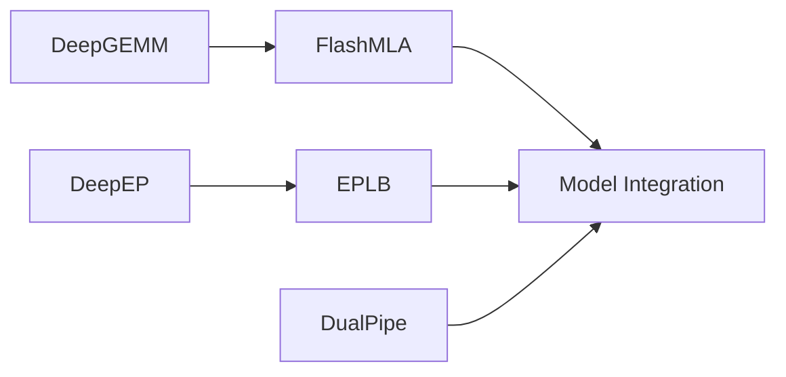
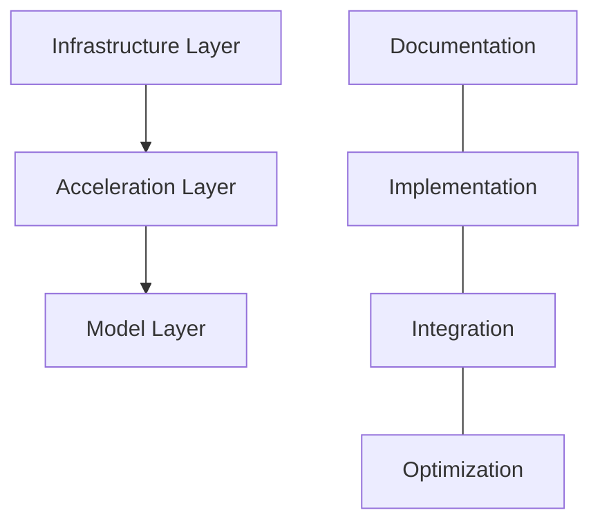

# VishwamAI Technical Documentation Suite: Executive Summary

## Document Overview

This technical documentation suite consists of six comprehensive analyses covering the core components, acceleration technologies, and model integrations of the VishwamAI system.

### Documentation Structure

1. **DeepGEMM Analysis** (01_deepgemm_analysis.md)
   - FP8 matrix multiplication optimization
   - JIT compilation system
   - Performance characteristics
   - Hardware integration

2. **DeepEP Analysis** (02_deepep_analysis.md)
   - Expert parallelism communication
   - Network architecture
   - Performance optimization
   - Scaling characteristics

3. **DualPipe Analysis** (03_dualpipe_analysis.md)
   - Bidirectional pipeline parallelism
   - Memory management
   - Performance metrics
   - Training integration

4. **EPLB Analysis** (04_eplb_analysis.md)
   - Expert load balancing
   - Dynamic adjustment
   - Resource optimization
   - Integration guidelines

5. **FlashMLA Analysis** (05_flashmla_analysis.md)
   - MLA kernel optimization
   - Memory management
   - Hardware support
   - Performance analysis

6. **Model Integration Analysis** (06_model_integration_analysis.md)
   - DeepSeek-V3, Grok-1, Gemma integration
   - Unified interface
   - Performance optimization
   - Future developments

## System Architecture Overview

## Key Performance Metrics

### 1. Computation Performance
| Component  | Metric           | Value        |
|------------|------------------|--------------|
| DeepGEMM   | Peak TFLOPS     | 1358         |
| FlashMLA   | Memory Bandwidth | 3000 GB/s    |
| DualPipe   | Training Speed  | 3.12 steps/s |

### 2. Communication Performance
| Component | Metric           | Value    |
|-----------|------------------|----------|
| DeepEP    | NVLink Bandwidth | 158 GB/s |
| DeepEP    | RDMA Bandwidth   | 47 GB/s  |
| EPLB      | Load Variance    | 5%       |

### 3. Model Performance
| Model      | Tokens/s | Memory (GB) |
|------------|----------|-------------|
| DeepSeek-V3| 32       | 120        |
| Grok-1     | 28       | 80         |
| Gemma      | 180      | 14         |

## Integration Guidelines

### 1. System Requirements
- NVIDIA Hopper GPUs (primary)
- CUDA 12.8+
- PyTorch 2.0+
- NVLink/RDMA support

### 2. Deployment Options
1. **Single Node**
   - Direct model loading
   - Local optimization
   - Memory efficiency

2. **Distributed**
   - Multi-node support
   - Expert parallelism
   - Pipeline parallelism

## Future Development Roadmap

### 1. Short-term Goals
- Enhanced FP8 support
- Improved load balancing
- Extended hardware support
- Performance optimization

### 2. Long-term Vision
- Cross-model integration
- Advanced scheduling
- Resource optimization
- Platform expansion

## Document Relationships

### 1. Component Dependencies

### 2. Integration Flow

## Conclusion

The VishwamAI technical documentation suite provides a comprehensive overview of the system's architecture, components, and capabilities. Each document offers detailed insights into specific aspects while maintaining clear relationships with other components.

The modular architecture, combined with efficient acceleration technologies and state-of-the-art model integrations, positions VishwamAI as a powerful and flexible AI infrastructure solution.

For specific implementation details, performance characteristics, or integration guidelines, please refer to the respective technical documents in this suite.
