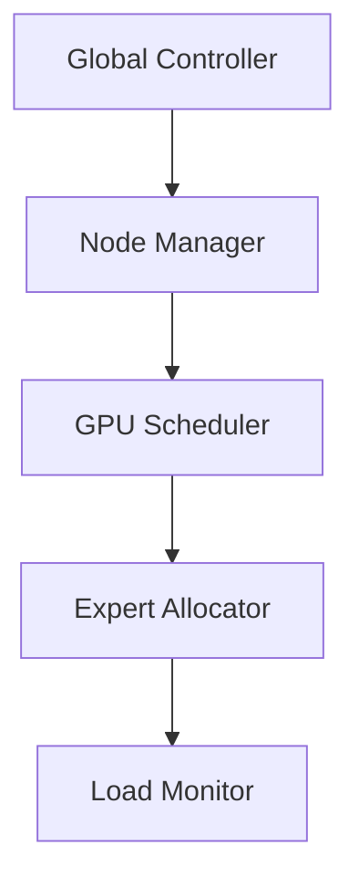

# EPLB: Expert Parallelism Load Balancing Analysis

## System Overview

### 1. Core Architecture

#### 1.1 Load Balancing Strategy
```python
class EPLBSystem:
    def __init__(self, num_experts, num_nodes):
        self.num_experts = num_experts
        self.num_nodes = num_nodes
        self.expert_map = {}
        self.load_stats = LoadStatistics()
```

#### 1.2 Hierarchical Design


### 2. Load Balancing Mechanisms

#### 2.1 Hierarchical Balancing
```python
class HierarchicalBalancer:
    def __init__(self):
        self.group_balancer = GroupBalancer()
        self.node_balancer = NodeBalancer()
        self.gpu_balancer = GPUBalancer()
    
    def balance(self, workload):
        groups = self.group_balancer.pack_experts(workload)
        node_assignment = self.node_balancer.distribute(groups)
        return self.gpu_balancer.fine_tune(node_assignment)
```

#### 2.2 Global Balancing
```python
class GlobalLoadBalancer:
    def __init__(self, config):
        self.replication_factor = config.replication_factor
        self.assignment_strategy = config.strategy
        
    def optimize_placement(self):
        # Global optimization for expert placement
        placement = self.compute_optimal_placement()
        self.update_routing_table(placement)
```

## Implementation Details

### 1. Expert Management

#### 1.1 Expert Allocation
```python
class ExpertAllocator:
    def allocate_experts(self, expert_config):
        allocation = {
            "group_size": expert_config.group_size,
            "replication": expert_config.replication,
            "placement": self.compute_placement()
        }
        return allocation
```

#### 1.2 Load Monitoring
```python
class LoadMonitor:
    def __init__(self):
        self.metrics = {
            "compute_util": [],
            "memory_util": [],
            "communication_overhead": []
        }
        
    def update_metrics(self, new_metrics):
        for key, value in new_metrics.items():
            self.metrics[key].append(value)
```

### 2. Dynamic Adjustment

#### 2.1 Runtime Adaptation
```python
class RuntimeOptimizer:
    def adjust_allocation(self, load_metrics):
        if self.detect_imbalance(load_metrics):
            new_allocation = self.recompute_allocation()
            self.migrate_experts(new_allocation)
```

#### 2.2 Migration Strategy
```python
def plan_migration(current_state, target_state):
    migration_plan = {
        "moves": [],
        "cost": 0,
        "estimated_downtime": 0
    }
    return migration_plan
```

## Performance Analysis

### 1. Load Distribution Metrics
| Scenario | Load Variance | Throughput Impact | Migration Cost |
|----------|--------------|------------------|----------------|
| Initial  | 15%          | Baseline         | N/A            |
| Balanced | 5%           | +25%            | 2.3s           |
| Dynamic  | 8%           | +18%            | 0.8s           |

### 2. Scaling Characteristics
```python
def analyze_scaling_efficiency(num_experts, num_nodes):
    efficiency_matrix = {
        64: {
            8: 0.95,    # 8 nodes
            16: 0.92,   # 16 nodes
            32: 0.88    # 32 nodes
        },
        128: {
            8: 0.93,
            16: 0.90,
            32: 0.86
        }
    }
    return efficiency_matrix[num_experts][num_nodes]
```

## Integration Guidelines

### 1. System Configuration
```python
def configure_eplb(system_config):
    eplb_config = {
        "monitoring_interval": 100,  # ms
        "rebalance_threshold": 0.15, # 15% imbalance
        "migration_policy": "cost_aware",
        "placement_strategy": "hierarchical"
    }
    return EPLBConfig(**eplb_config)
```

### 2. Model Integration
```python
class ModelIntegration:
    def setup_expert_balancing(self, model):
        expert_layers = self.identify_expert_layers(model)
        return self.configure_balancing(expert_layers)
```

## Optimization Techniques

### 1. Prefilling Optimization
```python
class PrefillingOptimizer:
    def optimize_prefill(self, batch_size, sequence_length):
        strategy = {
            "group_size": self.compute_optimal_group_size(),
            "pipeline_depth": self.determine_pipeline_depth(),
            "memory_strategy": "dynamic"
        }
        return strategy
```

### 2. Decoding Optimization
```python
class DecodingOptimizer:
    def optimize_decoding(self):
        optimizations = {
            "expert_caching": True,
            "priority_scheduling": True,
            "adaptive_batching": True
        }
        return optimizations
```

## Future Development

### 1. Planned Enhancements
- Predictive load balancing
- Automated configuration tuning
- Enhanced migration strategies
- Multi-datacenter support

### 2. Research Directions
- ML-based load prediction
- Advanced placement algorithms
- Network topology awareness
- Energy-efficient balancing
