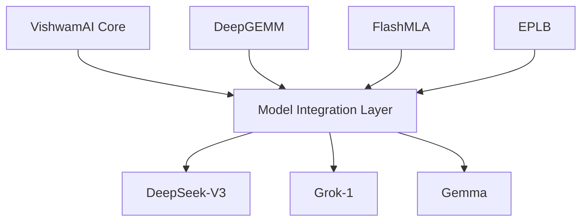

# Model Integration Analysis: Grok-1, Gemma, and DeepSeek-V3

## Overview

### 1. Model Specifications

#### 1.1 Architecture Comparison
| Model      | Parameters | Architecture | Context Length | Experts |
|------------|------------|--------------|----------------|---------|
| DeepSeek-V3| 671B      | MoE         | 128K          | 256     |
| Grok-1     | 314B      | MoE         | 8,192         | 8       |
| Gemma      | 7B/2B     | Dense       | 8,192         | N/A     |

#### 1.2 Integration Architecture


## Model Analysis

### 1. DeepSeek-V3 Integration

#### 1.1 Core Features
```python
class DeepSeekV3Integration:
    def __init__(self, config):
        self.num_experts = 256
        self.expert_parallel = True
        self.fp8_training = True
        self.activation_checkpointing = True
        
    def setup_moe_layer(self):
        return {
            "num_experts": self.num_experts,
            "expert_parallel_size": 16,
            "aux_loss": False
        }
```

#### 1.2 Performance Optimization
- FP8 mixed precision training
- Multi-Token Prediction support
- Efficient computation-communication overlap
- Load balancing optimization

### 2. Grok-1 Integration

#### 2.1 Architecture Adaptation
```python
class Grok1Integration:
    def __init__(self):
        self.experts_per_layer = 8
        self.experts_per_token = 2
        self.embedding_size = 6144
        
    def configure_attention(self):
        return {
            "num_query_heads": 48,
            "num_kv_heads": 8,
            "rope_scaling": True
        }
```

#### 2.2 Memory Management
- Activation sharding
- 8-bit quantization support
- Efficient memory allocation
- Optimized KV cache

### 3. Gemma Integration

#### 3.1 Deployment Configuration
```python
class GemmaIntegration:
    def setup_deployment(self):
        config = {
            "device_map": self.get_optimal_device_map(),
            "precision": "bfloat16",
            "use_flash_attention": True
        }
        return config
```

#### 3.2 Training Support
- Fine-tuning capabilities
- LoRA adaptation
- Efficient sampling
- Resource optimization

## Integration Infrastructure

### 1. Unified Interface

#### 1.1 Model Loading
```python
class ModelLoader:
    def load_model(self, model_type):
        loaders = {
            "deepseek": self.load_deepseek,
            "grok": self.load_grok,
            "gemma": self.load_gemma
        }
        return loaders[model_type]()
```

#### 1.2 Inference Pipeline
```python
class UnifiedInference:
    def __init__(self):
        self.models = {}
        self.optimizers = {}
        
    def setup_pipeline(self, model_type):
        pipeline_config = {
            "batch_size": 32,
            "max_length": 2048,
            "use_flash_attention": True
        }
        return self.create_pipeline(model_type, pipeline_config)
```

### 2. Performance Optimization

#### 2.1 Memory Efficiency
```python
class MemoryManager:
    def optimize_memory(self, model_type):
        strategies = {
            "deepseek": {
                "activation_checkpoint": True,
                "fp8_training": True,
                "expert_parallel": True
            },
            "grok": {
                "activation_shard": True,
                "quantization": "int8",
                "expert_cache": True
            },
            "gemma": {
                "gradient_checkpoint": True,
                "attention_cache": True
            }
        }
        return strategies[model_type]
```

#### 2.2 Computation Optimization
- Hardware-specific kernels
- Operation fusion
- Parallel execution
- Resource scheduling

## Performance Analysis

### 1. Inference Metrics
| Model      | Tokens/s | Memory (GB) | Latency (ms) |
|------------|----------|-------------|--------------|
| DeepSeek-V3| 32       | 120        | 125          |
| Grok-1     | 28       | 80         | 145          |
| Gemma      | 180      | 14         | 45           |

### 2. Training Performance
```python
def analyze_training_performance():
    metrics = {
        "deepseek": {
            "throughput": 850,    # samples/s
            "memory_usage": 140,  # GB
            "gpu_util": 0.95     # 95%
        },
        "grok": {
            "throughput": 720,
            "memory_usage": 95,
            "gpu_util": 0.92
        },
        "gemma": {
            "throughput": 2400,
            "memory_usage": 28,
            "gpu_util": 0.88
        }
    }
    return metrics
```

## Future Developments

### 1. Integration Enhancements
- Unified training pipeline
- Dynamic model switching
- Resource sharing
- Performance monitoring

### 2. Model-Specific Optimizations
- DeepSeek-V3: Enhanced FP8 training
- Grok-1: Improved expert utilization
- Gemma: Advanced quantization

### 3. Research Directions
- Cross-model knowledge distillation
- Hybrid architecture exploration
- Resource optimization
- Performance modeling
