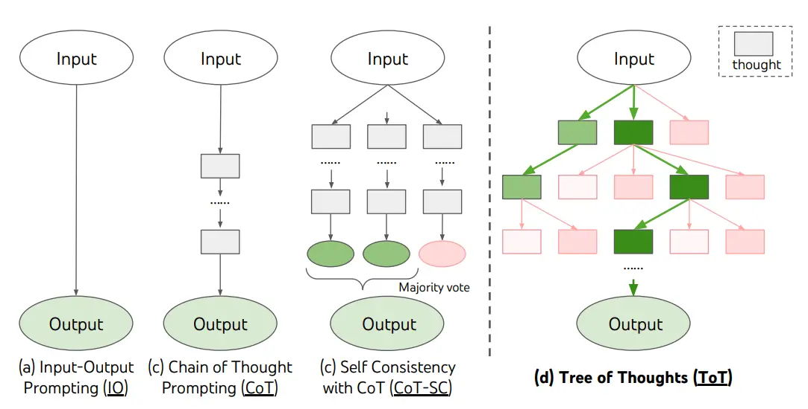
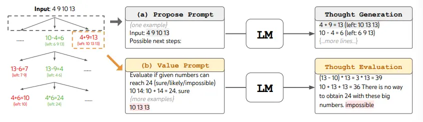
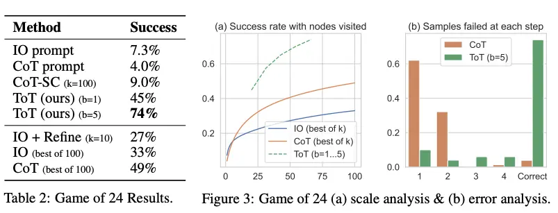

# Tree of Thoughts (ToT)

For complex tasks that require exploration or strategic lookahead, traditional prompting techniques often fall short. Recent works by Yao et al. (2023) and Long (2023) propose the **Tree of Thoughts (ToT)** framework—a method that generalizes chain-of-thought prompting by encouraging the exploration of multiple intermediate steps (or “thoughts”) during problem solving with language models.

---

## Overview

ToT maintains a **tree of thoughts**, where each thought is a coherent language sequence serving as an intermediate step toward the final solution. This approach enables a language model to:

- **Self-evaluate** its intermediate progress.
- Combine thought generation with evaluation.
- Systematically explore alternative reasoning paths using search algorithms such as breadth-first search (BFS) and depth-first search (DFS).

---

## The ToT Framework

### Key Concepts

- **Intermediate Thoughts:** Coherent, self-contained pieces of reasoning that build toward solving a problem.
- **Search Algorithms:**  
  - **BFS/DFS/Beam Search:** Standard search strategies used to explore and prune the tree of thoughts.
  - **ToT Controller (Long, 2023):** An RL-trained controller that dynamically decides when to backtrack and how many levels to backtrack, enabling adaptation to specific problems.

### Process Illustration

1. **Thought Generation:**  
   The language model generates several candidate thoughts at each step.
2. **Evaluation:**  
   Each candidate is evaluated (e.g., as "sure", "maybe", or "impossible") based on its likelihood of contributing to a correct solution.
3. **Search & Pruning:**  
   The model employs search algorithms to look ahead, backtrack when necessary, and maintain a fixed number of promising candidates (e.g., keeping the best *b = 5* thoughts at each step).

---

## Example: Game of 24

In the Game of 24 task, the problem is decomposed into **3 steps** where each step involves forming an intermediate equation. At every step:

- The model generates multiple candidate equations.
- It evaluates each candidate’s potential to reach the target number (24) by labeling them as "sure", "maybe", or "impossible".
- Values are sampled multiple times per thought (e.g., 3 samples per candidate) to decide which candidates to keep for further exploration.

### Visual Illustrations

#### ToT Framework Diagram
*Image Source: Yao et al. (2023)*

#### BFS Process for Game of 24
*Image Source: Yao et al. (2023)*

#### Performance Comparison
*Image Source: Yao et al. (2023)*

*Code available [here](#) and [here](#).*

---

## Comparative Approaches

Both Yao et al. (2023) and Long (2023) enhance complex problem solving via multi-round conversations and tree search:
- **Yao et al. (2023):**  
  Utilizes generic search strategies (DFS/BFS/beam search) to navigate through thought candidates.
- **Long (2023):**  
  Proposes a "ToT Controller" trained via reinforcement learning. This controller adapts the tree search strategy (e.g., determining backtracking levels) based on problem-specific feedback—similar in spirit to how AlphaGo learns through self-play.

---

## Extensions and Variants

### Tree-of-Thought Prompting by Hulbert (2023)

Hulbert (2023) introduced a simplified version of ToT prompting that embeds the evaluation of intermediate thoughts within a single prompt. For example, a sample prompt might be:

> **Imagine three different experts are answering this question.  
> All experts will write down 1 step of their thinking, then share it with the group.  
> Then all experts will go on to the next step, etc.  
> If any expert realizes they're wrong at any point, they leave.  
> The question is...**

This method leverages the same tree-based idea without the need for multiple rounds of prompting.

### PanelGPT by Sun (2023)

Sun (2023) expanded on the ToT concept by introducing **PanelGPT**—a variation where the language model simulates a panel discussion among experts. In this setup, multiple experts debate step by step to reach a consensus answer, further boosting reasoning robustness.

---

## Conclusion

Tree of Thoughts (ToT) represents a significant evolution in prompt engineering for language models. By maintaining a tree of intermediate thoughts and combining search algorithms with self-evaluation, ToT enables:
- **Enhanced reasoning capabilities.**
- **Systematic exploration** of possible solutions.
- **Adaptability** through reinforcement learning techniques (in RL-based ToT).

This framework not only outperforms traditional chain-of-thought prompting on complex tasks like the Game of 24 but also inspires new prompting variants such as Hulbert’s single-prompt ToT and Sun’s PanelGPT.

---

## References

- Yao, S., Yu, D., Zhao, J., Shafran, I., Griffiths, T. L., Cao, Y., & Narasimhan, K. (2023). *Tree of Thoughts: Deliberate Problem Solving with Large Language Models*.
- Long, O. (2023). *Large Language Model Guided Tree-of-Thought*.
- Hulbert, D. (2023). *Tree-of-Thought Prompting*.
- Sun, H. (2023). *PanelGPT: Prompt Language Models with a Panel Discussion*.
